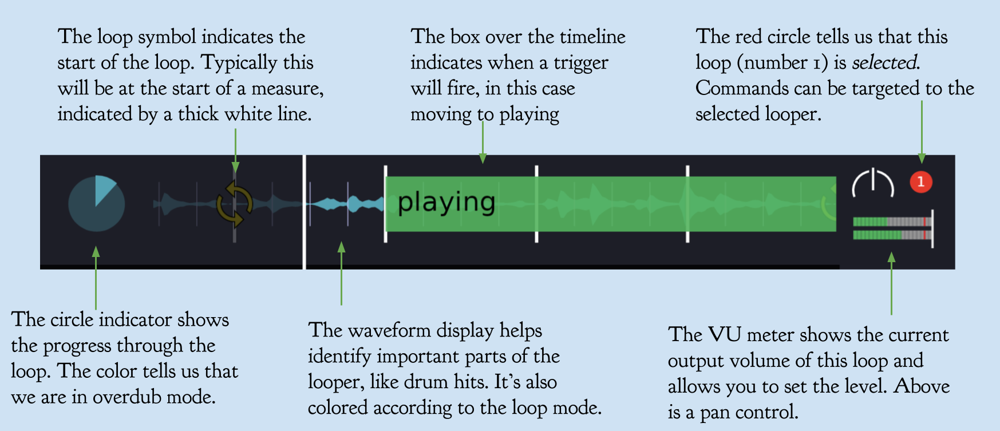
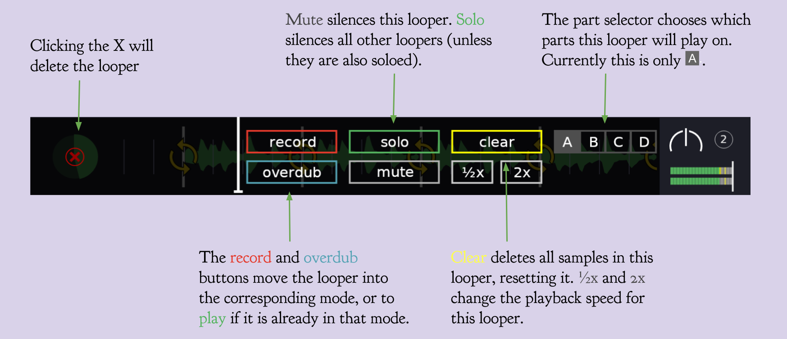
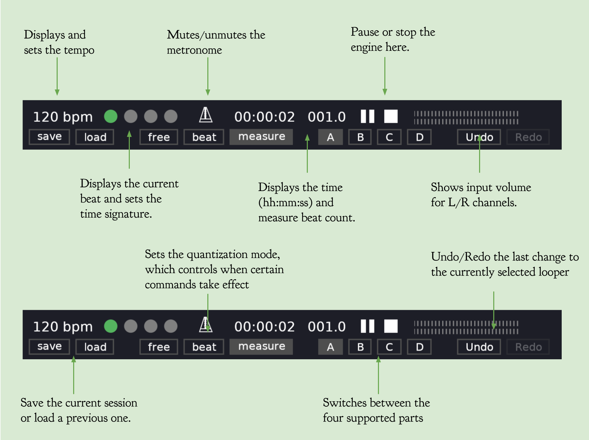

# Loopers


[](https://crates.io/crates/loopers)

Loopers is a graphical [live looper](http://www.livelooping.org/),
written in Rust, designed for ease of use and rock-solid stability. It
can be used as a practice tool, compositional aid, or for performing
looped works in a live setting.

Currently it runs on Linux as a standalone
[Jack](https://jackaudio.org/) application, which allows it to
interface with other Jack clients like effect racks, software
instruments, and DAWs, or on MacOS using Jack or (experimentally)
directly with CoreAudio.


The system is modeled as a series of hardware loop units (like the
Boss Loop Station) which are synchronized with a single time
control. The number of loop units is limited only by your display
size, and loop lengths are limited only by available memory.

## Features

* Multiple loops synchronized by a common time control
* Loops can be recorded to (setting loop length), overdubbed, cleared, muted, and soloed
* Up to four parts can be used to divide up portions of a performance
* Supports beat, measure, and free quantization of loop commands making it easy to keep things in sync
* Unlimited undo/redo
* Double speed and half speed playback (and overdubbing!)
* Every operation can be controlled via the GUI or MIDI
* Sessions can be saved and restored
* A built-in metronome (on a separate Jack output) helps keep you in time with your loops
* No limitations on loop lengths aside from your computer's memory
* Cross-fading ensures a perfect loop, every time
* It's fun!

## Getting started

### Linux

To build loopers, you will need jack and sdl2.

For Ubuntu/Debian these can be installed with:

```bash
$ sudo apt install jackd2 libjack-jackd2-dev libgl1-mesa-dev libsdl2-dev
```

Now you're ready to install loopers itself. First get a rust toolchain
installed (https://rustup.rs), then:

```bash
$ cargo install loopers
```

Then start it with the command

```bash
$ loopers
```

(If you get an error about Jack not running, you will need to start
the Jack server first. See the [Jack
documentation](https://jackaudio.org/) for details.)

This will create a Jack client, which can be hooked up to your
inputs/outputs/effects with any number of tools (I recommend
[Claudia](https://kx.studio/Applications:Claudia) from KXStudio).

Loopers should also be fully compatible with [PipeWire](https://pipewire.org/),
which removes the need for a separate Jack server.

### MacOS

Loopers has experimental support for running on CoreAudio, the native
audio system for MacOS (you can also run it on top of [jack](https://jackaudio.org/) on
MacOS, which is currently better supported). To build on Mac with coreaudio:

```bash
$ brew install jack sdl2
$ cargo install loopers
$ loopers
```

By default it will run using CoreAudio. To run with jack instead,

```bash
$ loopers --driver jack
```

**Note: midi is not currently supported via coreaudio, and there is no ability to choose
audio sources and sinks (the default devices are used).**

## Documentation

### UI Tour


The UI is divided into two parts: the top contains the set of loopers,
while the bottom contains controls and settings for the
engine. Hovering over each looper shows controls for that looper,
including setting the parts the looper is part of and controlling the
mode.

Each looper displays some key information to allow the performer to
quickly understand its state:



Hovering over the looper produces controls for the looper (although
most performers will prefer to use hardware buttons)



At the bottom we find the engine controls



### Looper Modes

At any given time each looper can be in one of several modes, each
identified in the UI by a color:

<dl>
<dt> Play</dt>
<dd>
In play mode, the output from the looper is mixed in with all of the other
loopers and sent to the global output. This is the default mode.
</dd>

<dt> Record</dt>
<dd>
When recording is started, all existing samples for the looper are cleared.
Then new audio is recorded to a sample until recording is finished, establishing
the loop length.
</dd>

<dt> Overdub</dt>
<dd>
In overdub mode, we add new input on top of the existing samples in the looper,
without changing the loop length.
</dd>

</dl>

In addition to those exclusive modes, a looper can have one or more of
the following _modifiers_:


<dl>
<dt> Solo</dt>
<dd>
If solo is enabled, all other loopers will be silenced (aside from those that are
also in solo mode).
</dd>

<dt> Mute</dt>
<dd>
When mute is enabled the looper is silenced.
</dd>
</dl>

The modes and modifiers can be controlled via the UI or by sending a
midi command.

### Quantization

When using multiple loopers, it is generally desirable for them to be
synchronized together. In Loopers, this is accomplished by having a
single time control which is used across all loopers. It is also key
that loops have lengths which are exact multiples of each other (for
example, you might have a bass loop that is 4 times as long as your
rhythm loop). If the length is off by even a few milliseconds, it will
quickly be noticeable after a few repeats.

To help performers get loop lengths exactly in sync, Loopers provide a
_quantization_ feature. This allows you to synchronize commands (for
example, stopping recording and thus setting loop length) to certain
metric events.

It supports three quantization modes, set via buttons at the bottom of
the UI:

* **Free** this disables quantization, and causes all commands to take
  effect immediately
* **Beat** commands take effect on the next beat after they are
  issued, as determined by the tempo
* **Measure** commands take effect at the start of the next measure,
  as determined by the tempo and time signature

Some commands are affected by quantization, and some take effect
immediately. See the [commands reference](#commands) for more.

### Commands

Every aspect of the system can be controlled via commands, both in the
UI and via midi. For details on configuring midi controls, see
[settings](#settings).

There are two kinds of commands: looper commands, which are applied to
one or more loopers, and engine commands which apply to the system as
a whole. Commands can take parameters which control the behavior of the
command.

Looper commands all take a first parameter that determines
which looper will be targeted:

* **Selected**: targets only the selected looper, as controlled via
  the UI or by one of the `Select*Looper` commands
* **Id**: takes an _id_ parameter, and targets the looper with that
  id
* **Index**: takes an _index_ parameter and targets the looper at that
  index in the currently visible part, starting from 0.
* **All**: targets all loopers

Other commands may also take parameters which control their
behavior.

Commands also differ in how they are affected by quantization:

* **Immediate** commands take place as soon as they are received,
  regardless of quantization settings or the state of the system
* **Queued** commands will wait in a queue for other (possibly
  quantized) commands to take effect before being executed. This
  allows you to, for example, send the command to switch to the next
  part (a quantized command), then send a SelectNextLooper command
  (a queued command), which will wait for part switch before
  executing.
* **Quantized** commands will wait until the next quantization
  boundary (e.g., the start of the next measure, see
  [Quantization](#Quantization) for details) to execute.

#### Looper commands

| **Command** | **Parameters** | **Quantization** | **Description** |
|-|-|-|-|
| Record | Looper Targets | Quantized | Moves the selected loopers to the Record mode |
| Overdub | Looper Targets | Quantized | Moves the selected loopers to the Overdub mode |
| Play | Looper Targets | Quantized | Moves the selected loopers to the Play mode |
| RecordOverdubPlay | Looper Targets | Quantized① | Cycles from Record -> Overdub -> Play -> Overdub |
| Mute | Looper Targets | Immediate | Toggles the mute modifier on the selected loopers |
| Solo | Looper Targets | Immediate | Toggles the solo modifier on the selected loopers |
| Delete | Looper Targets | Immediate | Deletes the selected loopers |
| Clear | Looper Targets | Quantized | Clears all samples from the selected loopers |
| SetPan | Looper Targets, a pan value from -1 (fully left) to 1 (fully right) | Immediate | Sets the pan for the looper |
| SetLevel | Looper Targets, a level value from 0 (silent) to 1 (full volume) | Immediate | Sets the output level for the looper |
| 1/2x | Looper Targets | Immediate | Sets the looper to 1/2x speed |
| 1x | Looper Targets | Immediate | Sets the looper to 1x speed |
| 2x | Looper Targets | Immediate | Sets the looper to 2x speed |

① _RecordOverdubPlay is quantized from Record -> Overdub and Overdub ->
Play, but queued from Play -> Overdub._

#### Engine commands

| **Command** | **Parameters** | **Quantization** | **Description** |
|-|-|-|-|
| Start | _None_ | Immediate | Starts the engine |
| Stop | _None_ | Immediate | Stops the engine, resetting the time |
| StartStop | _None_ | Immediate | Starts the engine if it is stopped, otherwise stops it |
| PlayPause | _None_ | Immediate | Pauses the engine if it is active, otherwise restarts it |
| Pause | _None_ | Immediate | Stops the engine but does not reset the time |
| Reset | _None_ | Immediate | Resets the engine time |
| SetTime | Time (in samples) | Immediate | Sets the time to the specified number of samples |
| AddLooper | _None_ | Immediate | Adds a looper to the end of the current part |
| SelectLooperById | Looper Id | Immediate | Selects the looper with the given id |
| SelectLooperByIndex | Index | Immediate | Selects the looper at the given index in the current part (starting from 0) |
| SelectPreviousLooper | _None_ | Queued | Selects the previous looper in the current part, wrapping around from the first to the last |
| SelectNextLooper | _None_ | Queued | Selects the next looper in the current part, wrapping around from the last to the first |
| PreviousPart | _None_ | Quantized | Goes to the previous part, skipping those parts with no loopers |
| NextPart | _None_ | Quantized | Goes to the next part, skipping those parts with no loopers |
| GoToPart | One of `A`, `B`, `C`, or `D` | Quantized | Goes to the specified part |
| SetQuantizationMode | One of `Free`, `Beat`, or `Measure` | Immediate | Sets the quantization mode for the engine |
| SetMetronomeLevel | 0-100 | Immediate | Sets the metronome volume to the given percentage |
| SetTempoBPM | bpm (float) | Immediate | Sets the engine's tempo to the given BPM value |
| SetTimeSignature | upper, lower | Immediate | Sets the engine's time signature according to the parameters (e.g. 3, 4) |
| SaveSession | Path | Immediate | Saves the current session to the given path |
| LoadSession | Path | Immediate | Loads a session from the given path, replacing the existing one |


### Settings

Configuration is stored the standard system user config location
(typically this will be ~/.config/loopers/). Currently the configuration
consists of a set of mappings from midi messages to loopers
commands. These should be placed in a file called `midi_mappings.tsv`
in that config directory, which will be automatically created after loopers
is run for the first time.

Each non-empty line of this file should contain the following
tab-separated columns:

1. Midi channel (either `*` for any channel or a channel number)
2. Midi controller number
3. Midi data (can be `*` for any data, a single value like `50`,
   or a range like `0-100`)
4. Command name (see tables above)
5. Command arguments (multiple arguments should be tab-separated; the special 
   value `$data` can be used in the place of certain numerical arguments to 
   use the data value of the midi event, for example for use with an expression 
   pedal)
   
The midi values (channel, controller, data) can be thought of as _filters_ for incoming midi events; for each event
all matching commands will fire.

An example for configuring for use with the [Behringer
FCB1010](https://www.behringer.com/product.html?modelCode=P0089) (an
excellent pedalboard):

``` tsv
Channel	Controller	Data	Command	Arg1	Arg2	Arg3
*	22	127	RecordOverdubPlay	Selected
*	22	0	RecordOverdubPlay	Selected

*	23	127	SelectNextLooper
*	23	0	SelectNextLooper

*	24	127	NextPart
*	24	0	NextPart

*	25	127	Clear	Selected
*	25	0	Clear	Selected

*	26	127	PlayPause
*	26	0	PlayPause

*	27	0-127	SetPan	Selected	$data
```
